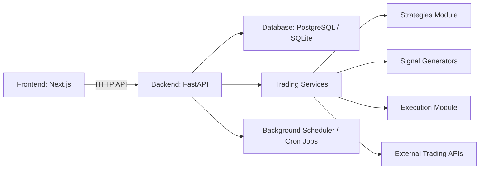
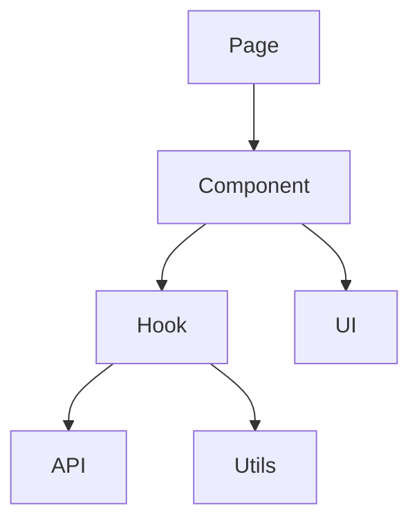
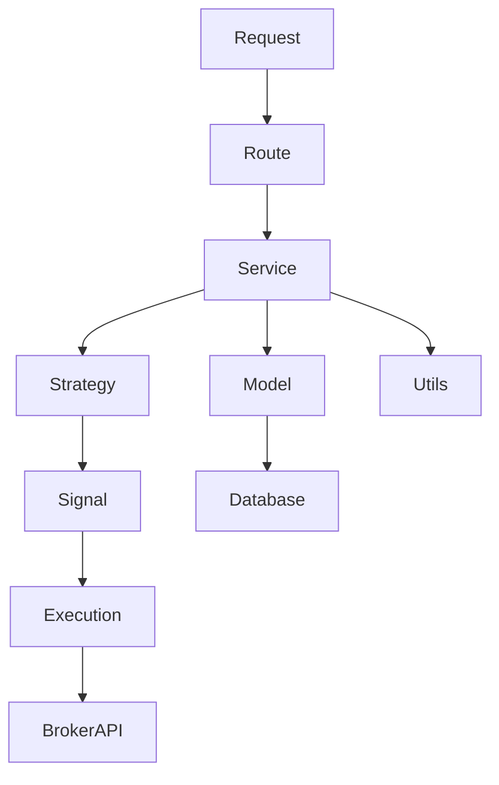
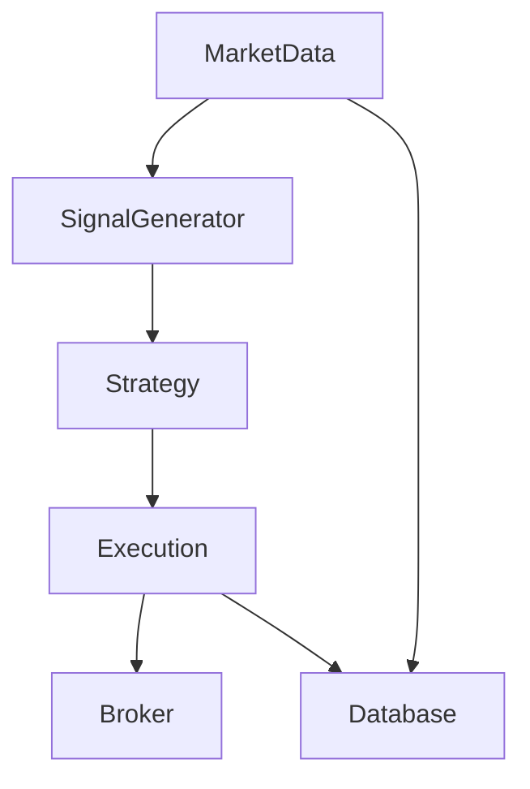

# Systematic Trading Web Application

This is a full-stack multi-page web application for **automated trading**. The backend is built with **FastAPI**, and
the frontend uses **Next.js** with **MUI** for UI components.

---

## Tech Stack

| Layer              | Technology                                         |
|--------------------|----------------------------------------------------|
| Backend            | **FastAPI**, **Polars** for data manipulation      |
| Frontend Framework | **Next.js** (Multi-page + SSR)                     |
| UI Components      | **MUI**                                            |
| API Client         | **Axios** or **Fetch**, optionally **React Query** |
| Database           | SQLite (Development)                               |

---

## File Structure

```bash
/my-fullstack-app
│
├── /backend
│   ├── main.py             # FastAPI app entry point
│   ├── requirements.txt    # Python dependencies
│   ├── /routes             # API route definitions
│   ├── /models             # Database models (SQLAlchemy)
│   ├── /schemas            # Pydantic models / request-validation
│   ├── /services           # Core business logic
│   │   ├── /strategies     # Trading strategies
│   │   │   ├── mean_reversion.py
│   │   │   ├── momentum.py
│   │   │   └── __init__.py
│   │   ├── /signals        # Signal generators
│   │   │   ├── price_action.py
│   │   │   └── indicators.py
│   │   ├── /execution      # Order execution & broker integration
│   │   │   ├── alpaca.py
│   │   │   └── binance.py
│   │   └── __init__.py
│   ├── /utils              # Helper functions (logging, data processing)
│   │   ├── logger.py
│   │   ├── data_loader.py
│   │   └── __init__.py
│   ├── /scheduler          # Background jobs, cron, async tasks
│   │   └── tasks.py
│   └── /tests              # Unit tests
│
├── /frontend
│   ├── package.json
│   ├── /pages              # Next.js pages
│   ├── /components         # Reusable UI components
│   ├── /styles             # Global CSS / themes
│   ├── /hooks              # Custom React hooks
│   ├── /contexts           # State management
│   ├── /utils              # Helpers
│   └── /tests              # Frontend tests
│
├── .gitignore
└── README.md
```

---

## Architecture Overview

### 1. System Architecture



**Description:**

* Frontend communicates with the backend via REST API or GraphQL (optional).
* Backend handles database queries, business logic, and connects to trading services or external APIs.
* Background jobs can manage scheduled trades or market data fetching.

---

### 2. Frontend Component Flow



**Description:**

* Pages render **components** that fetch data using **hooks**.
* Hooks call **backend APIs** and use **utils/helpers**.
* Components are styled using **MUI** and can share state via **contexts**.

---

### 2. Backend Trading Flow



#### Overview

Trader class, which loads the data, takes in the strategies (Strategy class) and gives out the buy sell
signals on the scale of -20 to 20.

-20: very strong sell, -15: strong sell, -10: good sell, -5: weak sell, 0: neutral, 20: very strong buy, 15: strong buy,
10; good buy, 5: weak buy

**Description:**

* **Strategy Module:** Contains algorithms like mean-reversion, momentum, or custom strategies.
* **Signal Generators:** Convert market data into actionable signals.
* **Execution Module:** Sends orders to brokers/exchanges (Alpaca, Binance, etc.).
* **Scheduler:** Handles periodic data fetching and automated trades.

---

### 3. Data Flow in Trading



**Description:**

* Market data is collected and optionally stored in the database.
* Signal generators process the data and feed strategies.
* Execution module places trades with brokers and logs outcomes.

---

This structure is **production-ready**, separates concerns clearly, and makes it easy to extend:

* Add new strategies without touching execution code.
* Add new brokers without touching strategies.
* Easy to test modules independently.

---
